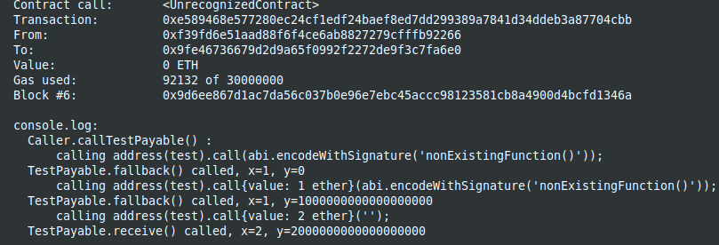

Sending and receiving ether, from Solidity documentation [Solidity documentation](https://docs.soliditylang.org/en/v0.8.11/contracts.html#receive-ether-function)

I used brownie with hardhat in order to deploy and use the console.log features.
You should start the hardhat node in another terminal and folder (`hh node`), then, in a terminal :

```
brownie compile
brownie run scripts/deploy.py
```

After deploying, in the hardhat console:


